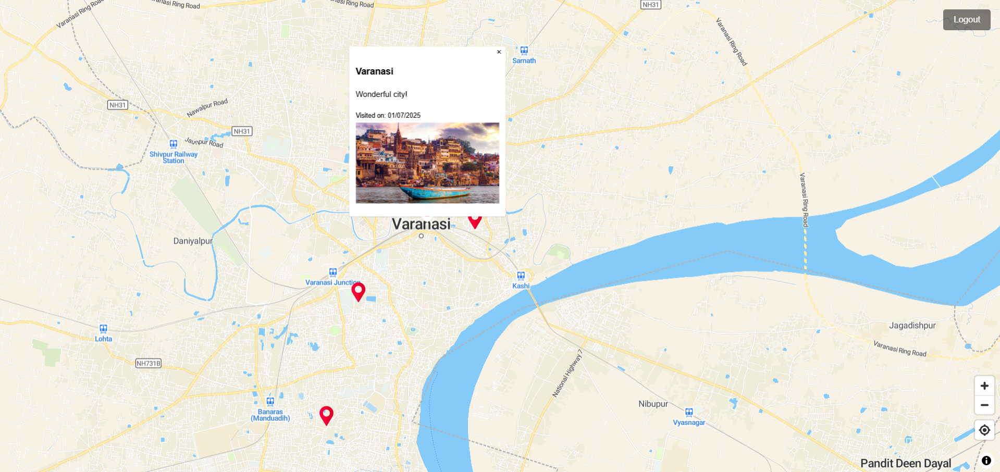

# 🌍 Roamify - Your Travel Log on the Map

Roamify is a full-stack MERN application that reimagines the travel blog. Instead of a simple list of posts, it allows users to pin their travel memories directly onto an interactive world map. Create, edit, and explore your journeys in a rich, geographical context.



---

## ✨ Core Features

-   🗺️ **Interactive World Map**: A dynamic and responsive map built with **React Map GL & MapLibre**. Add new travel entries simply by double-clicking anywhere on the globe.
-   📍 **Smart Location Search**: Quickly find any city, landmark, or address with an integrated search bar to center the map on your desired location.
-   ✍️ **Full CRUD for Entries**:
    -   **Create**: Add a new travel log with a title, comments, image, and visit date.
    -   **Read**: View all your entries as pins on the map. Click a pin to see the details in a popup.
    -   **Update**: Easily **edit** the details of any existing travel entry.
    -   **Delete**: Remove travel entries you no longer want to keep.
-   🔐 **Secure User Authentication**: A complete user system (Register/Login) using **JWT (JSON Web Tokens)** ensures that your travel logs are private and accessible only to you.
-   🧭 **Advanced Map Controls**:
    -   **Navigation Controls**: Effortlessly zoom in/out and rotate the map.
    -   **Geolocate Control**: Center the map on your current physical location with a single click.
-   ⚡ **Modern & Fast UI**: A smooth and snappy user experience built with **React and Vite**.

---

## 🛠 Tech Stack

The application is built with a modern MERN-like stack:

| Layer              | Technology / Service                               |
| ------------------ | -------------------------------------------------- |
| **Frontend** | React (with Vite)                                  |
| **Backend** | Node.js, Express.js                                |
| **Database** | MongoDB (with Mongoose ODM)                        |
| **Authentication** | JWT (JSON Web Tokens)                              |
| **Maps & Geocoding** | React Map GL, MapLibre GL JS                       |
| **Orchestration** | Concurrently                                       |
| **Deployment** | Vercel (Frontend) & Render (Backend/API)           |

---

## 🚀 Getting Started

Thanks to `concurrently`, getting the project running locally is quick and easy.

### Prerequisites

Make sure you have the following installed on your machine:

-   [Node.js](https://nodejs.org/en/) (v14 or higher)
-   [npm](https://www.npmjs.com/) or [yarn](https://yarnpkg.com/)
-   [Git](https://git-scm.com/)
-   A MongoDB instance (local or a cloud service like [MongoDB Atlas](https://www.mongodb.com/cloud/atlas))

### Installation & Setup

1.  **Clone the repository:**
    ```sh
    git clone https://github.com/gitApurv/Roamify.git
    cd Roamify
    ```

2.  **Configure Environment Variables:**
    -   In the `/server` directory, create a `.env` file with your credentials:
        ```env
        PORT=8080
        MONGO_URI=your_mongodb_connection_string
        CORS_ORIGIN=http://localhost:5173
        JWT_SECRET=your_super_secret_key
        ```
    -   In the `/client` directory, create a `.env` file with your credentials:
        ```env
        VITE_API_BASE_URL=http://localhost:8080/
        VITE_MAPTILER_API_KEY=your_maptiler_api_key
        VITE_CLOUDINARY_CLOUD=your_cloudinary_cloud_name
        ```

3.  **Install Dependencies:**
    From the **root directory** of the project, run the single command to install dependencies for both the frontend and backend:
    ```sh
    npm run install-all
    ```

### Running the Application

-   All commands should be run from the **root directory** of the project.
-   To run both the frontend and backend servers simultaneously with hot-reloading for development, use the **`dev`** command:

    ```sh
    npm run dev
