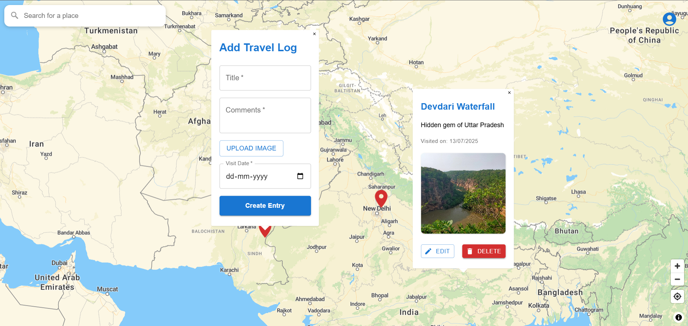

# 🌍 Roamify

**👉 A project that turns personal journeys into an interactive, visual storytelling experience.**

Roamify is a full-stack MERN application that reimagines the travel blog. Instead of static posts, it lets users pin their journeys on an interactive world map, attach stories, and visually revisit their adventures.

## ✨ Key Features

- 🗺️ **Interactive World Map**: Built with React Map GL & MapLibre for an immersive experience.
- 📍 **Smart Location Search**: Quickly find cities, landmarks, or addresses.
- ✍️ **Full CRUD for Entries**: Add, view, edit, and delete entries with ease.
- 🔐 **Secure User Authentication**: JWT-based authentication for private travel logs.
- 🧭 **Advanced Map Controls**: Smooth zoom, rotation, and geolocation support.
- ⚡ **Modern & Fast UI**: Fast, clean, and intuitive experience with React + Vite.

## 🛠 Tech Stack

The application is built with a modern MERN-like stack:

| Layer          | Technology / Service             |
| -------------- | -------------------------------- |
| **Frontend**   | React (Vite), MapLibre GL        |
| **Backend**    | Node.js, Express.js              |
| **Database**   | MongoDB (Mongoose ODM)           |
| **Auth**       | JWT (JSON Web Tokens)            |
| **Deployment** | Vercel (Frontend) & Render (API) |
